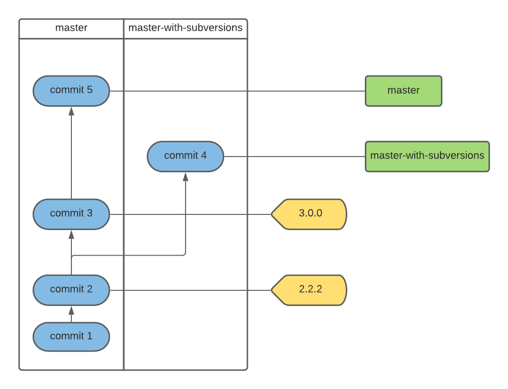

.. Versup documentation master file, created by
   sphinx-quickstart on Tue Apr  7 10:44:55 2020.
   You can adapt this file completely to your liking, but it should at least
   contain the root `toctree` directive.

Versup documentation
====================

Readme File
===========

Versup automates versioning up a project by creating a commit, tagging the release,
creating a changelog, and updating the version across files. Of course, this is all
configurable.

Quickstart
==========

All versup needs is the increment or new version number. If you just want to increase
the semantic version you can invoke it with

.. code:: bash

   versup minor

or if you want to specify the version with

.. code:: bash

   versup 1.72.3

If you specifiy a version number, then versup will take that version and apply
it to the current project as is. If you provide an increment, it will get the
last version number from either the latest git tag that has a valid version,
or from the default version in the config file.

Configuration
=============

Versup has a default configuration which is shown below

.. include:: ../../versup/default_conf.py
   :literal:

If you want to override any settings, you can do this by creating a `~/.config/versup.json`
file or a `.versup.json` in your local project. Versup will read its default settings,
then merge in the global config (`~/.config/versup.json`), and finally
merge in the project level config.

Template tags
=============

In various places you can define what text to use for commit messages, or tags etc.
These support tag fields that are replaced with information. Know fields are:

- [version]: The new version
- [message]: The new commit message
- [date]: Today's date formatted according to `tokens/date/format` in the config
- [version_date]: Today's date formatted according to `tokens/version_date/format` in the config
- [hash]: The new commit hash, full length
- [hash4]: The new commit hash, first four characters
- [hash7]: The new commit hash, first seven characters
- [hash8]: The new commit hash, first eight characters
- [author_name]: The author name from the git config
- [author_email]: The author email from the git config

Updating files
==============

versup can update versions in files. The way this works is by configuring a regex
for each file that you want to update. So for example:

.. code::

   "files": {
      "README.rst": [
         ["Version ([\\d\\.]+) ", "Version [version] "],
         ["Version is ([\\d\\.]+)", "Version is [version]"]
      ]
   }

Here the file `README.rst` is updated by matching a regex `Version ([\\d\\.]+)`
which will match any text like `Version 1.3` or `Version 1.3.7`. They are standard
regular expressions. The text that is matched is then replaced with the next argument
`Version [version]` where `[version]` is the new version. You can regex and replace on
anything really.

Increment actions
=================

The supported increments are those supported by
`Python Semver <https://python-semver.readthedocs.io/en/latest/usage.html#raising-parts-of-a-version>`_.

- major
- minor
- patch
- prerelease

as well as

- prepatch
- preminor
- premajor
- release

The last four types are special in addition to the default ones included with `semver`.
What these do is increment the relevant version component and apply a prerelease.

.. code::

    1.2.3 -> prepatch -> 1.2.4-rc.1
    1.2.3 -> preminor -> 1.3.0-rc.1
    1.2.3 -> premajor -> 2.0.0-rc.1
    1.2.3-rc.3 -> release -> 1.2.3

If you try to call `release` on a version that has no pre-release component,
Versup will error and exit.

Please note that calling `patch`, `minor`, or `major` on a pre-release version will
do that same as semver. That is

.. code::

    1.2.3-rc.1 -> patch -> 1.2.3
    1.2.3-rc.1 -> minor -> 1.3.0
    1.2.3-rc.1 -> major -> 2.0.0

Versup will try to retrieve the latest version from the list of previous
tags. Any tag that is a valid semantic version is considered to be a tag.
It will also only retrieve tags that are ancestors of the current commit.

In this example

If the currently checked out commit is ``commit 4``, running ``versup minor``
will result in the next version being ``2.3.0``, as the ``3.0.0`` tag isn't
reachable from ``commit 4``

Scripts
=======

There are a number of pre and post scripts that can be executed at various
stages of the bump process. These are under the `scripts` section. They are
called as-is and receive the new version number as the only argument. They
can be anything, shell scripts, python scripts, etc, but they must be
executable in a regular shell, as they will be invoked as such.

Commandline options
===================

Versup has two command line options

.. code::

   Options:
   --version   Show the version and exit.
   -h, --help  Show this message and exit.

And the following Commands

.. code::

   increment/version  Increment or set project version
   show-config Show the config to be used for the next version updated

The `increment` or `version` command has the following options

.. code::

   --no-commit     Skip making commit
   --no-changelog  Skip changelog update
   --no-tag        Skip creating tag
   -n, --dryrun    Show what will be done but don't apply anything

The `show-config` command accepts these options

.. code:: bash

   -l, --local Show the local configuration options
   -g, --global Show the global configuration options

Contributing to Versup
======================

If you'd like to contribute to Versup please read the :ref:`developer-pages` guide

Indices and tables
==================

* :ref:`modindex`
* :ref:`search`

.. toctree::
   :maxdepth: 2
   :caption: Contents:

